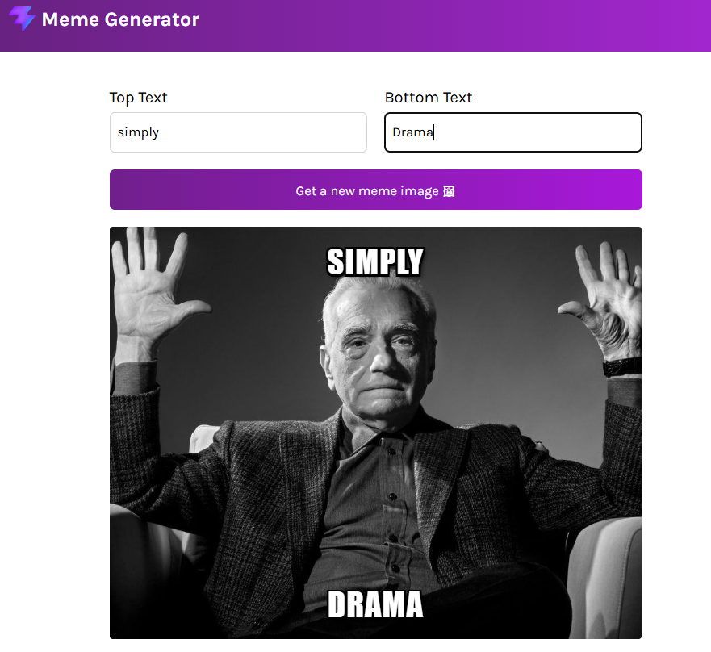

# MemeGenerator (React + Vite)

A simple React meme generator.

## What happens in the UI
- `src/components/Main.jsx` renders:
  - Two text inputs (top and bottom)
  - A button: **Get a new meme image**
  - The meme preview (``) with the two text overlays.

## How the meme image changes
1. On page load, the app fetches the meme list from **imgflip**:
   - `https://api.imgflip.com/get_memes`
2. When you click **Get a new meme image**, it picks a random meme from the fetched list and updates `meme.imageUrl`.
3. The `` updates, so you see a new meme image.

## Quiz on Use effect

1. Pure Functions in React (1:12:40:51 - 1:12:42:01)
React components are meant to behave like pure functions. This means:

Given the same inputs (props or state), a component should always return the same user interface (UI).
The act of rendering or running the component function should never affect any system outside of itself.
2. Side Effects in React (1:12:43:46 - 1:12:44:06, 1:13:09:44 - 1:13:10:35)
A side effect is any code that interacts with or affects an outside system (outside the React ecosystem). Examples include:

Fetching data from an API.
Interacting with local storage.
Subscribing to Websocket connections.
Manual DOM manipulation.
3. What is NOT a Side Effect? (1:13:10:38 - 1:13:11:05)
Any task that React is officially in charge of is not considered a side effect. Examples include:

Maintaining internal state.
Keeping the UI in sync with data.
Rendering DOM elements to the screen.
4. When does useEffect run? (1:13:11:07 - 1:13:12:02)
When it runs: It always runs after the component renders for the first time (when it mounts to the page). If no dependencies array is provided, it will run on every single re-render of the component.
When it does NOT run: If you provide a dependencies array, the effect will only re-run if the values within that array have changed between renders. If those values remain the same, React will skip running the effect.
5. What is the Dependencies Array? (1:12:58:39 - 1:13:00:00)
The dependencies array is the second parameter passed to the useEffect function. It is a tool that allows React to know exactly when it should re-run your effect function. By comparing the values inside this array between renders, React determines if the side effect needs to be synchronized again.

## Output 

