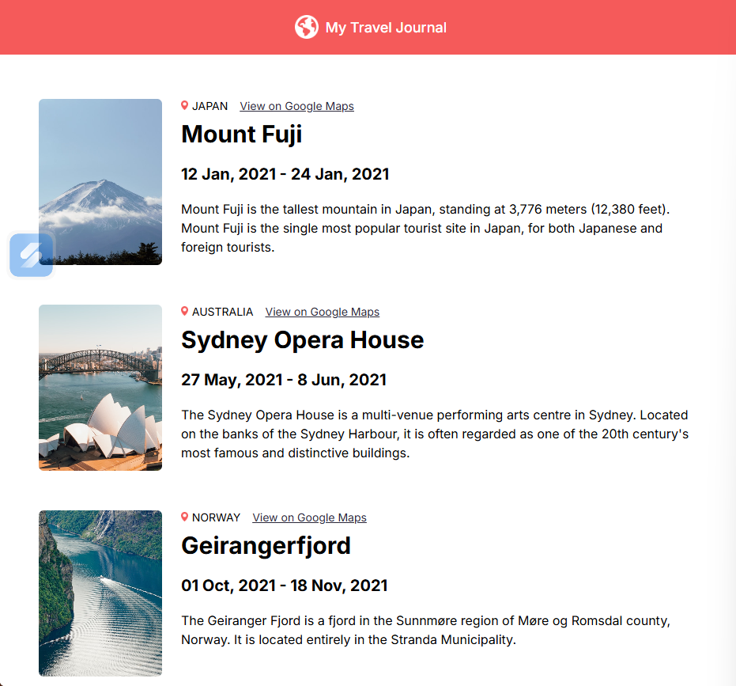

# Travel Journal



A simple React application that displays a travel journal with 3 static entries from around the world. Demonstrates key React concepts like:
- Reusability with components (`Header`, `Entry`)
- Props for passing data
- Mapping arrays to JSX elements

## Features
- Header with globe icon and title
- Travel entries with:
  - Country flag/marker and Google Maps link
  - Location image
  - Title, dates, and description
- Responsive layout using CSS classes

## Entries
1. **Mount Fuji, Japan** (Jan 2021)
2. **Sydney Opera House, Australia** (May-Jun 2021)
3. **Geirangerfjord, Norway** (Oct-Nov 2021)

## File Structure
```
src/
├── App.jsx          # Maps data to Entry components
├── data.js          # Hardcoded travel entries
├── components/
│   ├── Header.jsx   # App header
│   └── Entry.jsx    # Individual entry renderer
└── assets/          # Icons (globe.png, marker.png)
```

## Tech Stack
- React 19
- Vite (build tool)
- Vanilla CSS

## Run Locally
1. Install dependencies:
   ```
   npm install
   ```
2. Start dev server:
   ```
   npm run dev
   ```
3. Open [http://localhost:5173](http://localhost:5173)

## Build for Production
```
npm run build
```

Built during React learning (Scrimba course concepts applied).


